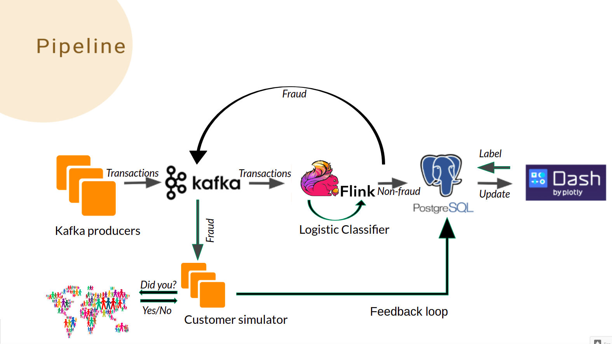
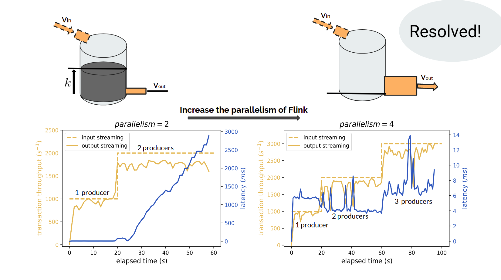

# FraudAlert: *"Real-Time Fraud Detection"*

By Xiaoling (Shawn) Zhai at 2019 Summer Data engineering Program of Insight Data Science (Silicon Valley).

## Project Summary:
This project built a real-time credit card fraud detection system with [**Flink**],[**Kafka**] and [**PostgreSQL**]. A feedback loop is incorporated in the system to receive the answers of customers. The throughput can be as high as 3000 transactions/s and latency can be as short as 10 ms. A logistic classifier is implemented in Flink to decide whether a transaction is a fraud or not.

[**Project Website**] (dataengineer.club) 
[**Project Slides**] (http://bit.ly/FraudAlert-Slides) 
[**Video of My Demo**] (https://youtu.be/GVvsHnoD9Nc) 
[**Video of My Presentation**] (https://youtu.be/a-F-9T7XXjM)

## Introduction:

### Background:
Every day, everyone uses credit cards in restanrants, markets and on the Internet. The point of sale sends back the transaction information to the bank to decide whether the transaction is a fraud or not. If it is not a fraud, the transaction is accepted, otherwise the transaction is rejected. My project is designed to build the fraud detection system.
### Use Case
Even though frauds are very few in transactions, the total amount of frauds is huge. For example, in 2015, the total number of transactions is 33 Billion and the total numbef of frauds is 30 million. The frauds thus cause a huge loss to card holders and points of sale. Therefore a good fraud detection system is necessary to process the non-fraud transactions quickily and prevent the fraud transactions in time.
### DataSet
The datasets contains transactions made by credit cards in September 2013 by european cardholders. This dataset presents transactions that occurred in two days, where we have 492 frauds out of 284,807 transactions. The dataset is highly unbalanced, the positive class (frauds) account for 0.172% of all transactions.

It contains only numerical input variables which are the result of a PCA transformation. Unfortunately, due to confidentiality issues, we cannot provide the original features and more background information about the data. Features V1, V2, ... V28 are the principal components obtained with PCA, the only features which have not been transformed with PCA are 'Time' and 'Amount'. Feature 'Time' contains the seconds elapsed between each transaction and the first transaction in the dataset. The feature 'Amount' is the transaction Amount, this feature can be used for example-dependant cost-senstive learning. Feature 'Class' is the response variable and it takes value 1 in case of fraud and 0 otherwise.

The dataset has been collected and analysed during a research collaboration of Worldline and the [**Machine Learning Group**] (http://mlg.ulb.ac.be) of ULB (Université Libre de Bruxelles) on big data mining and fraud detection.

## Data Pipeline:
This detection system has two branches including a streaming processing and a feedback loop.
### Architecture

### Streaming Processing in Flink
1. Kafka producers generate input streaming of transactions and sends the data to the topic transactions-foward in Kafka.
2. Kafka ingests streaming input data and sends to Flink for processing.
3. The logistic classifier implemented in Flink decides whether the transaction is a Fraud or not.
4. If the prediction of logistic classifier is non-fraud, the transaction is accepted and the data is saved in PostgreSQL.
5. If the prediction is fraud, the transaction is sent to the other topic transactions-backward in Kafka.
### Feedback Loop
1. If the prediction is fraud, the transaction is sent to the other topic transactions-backward in Kafka and then sent to customer simulator.
2. Customer simulator sends a SMS to the customer to ask whether he/she made the transaction. If the answer is "Yes, it is me", the transaction is accepted. If the answer is "No, it is not me", the transaction is rejected.
3. If the simulator doen't receive the reply in time, the transaction is pushed to Dash where a banker processes the transaction manually. The banker gives the customer a phone call and decides to accept or reject based on the answer. If nobody listens, the transaction is rejected and marked as "no reply".

### UI provides real-time monitor on the results and manual processing capacity of bankers. 
1. "start", "second", "third", and "stop" button: start the input streaming, turn on the second Kafka producer, turn on the third Kafka producer, stop the whole pipeline.
2. "call" button: a banker can give a call to the current phone number poped in Dash.
3. "Yes: Accept", "No: Reject", and "No answer: Reject" button: accept the transaction since the answer is "yes, I made the transaction", reject the transaction since the answer is "no, I didn't make the transaction", reject the transaction since nobody listens the call.
4. Left window: the transaction throughput (number of transactions per second) as a function of elapsed time.
5. Right window: the latency as a function of elapsed time.
6. "#True Pos." and "#False Pos." button: report how many transactions are predicted to be frauds correctly, report how many transactions are predicted to be frauds incorrectly.

## Result
### Throughput and latency
When the throughput is below 2000 transactions per second, the latency time is below 10 ms. When the throughput inceases to 3000 transactions per second, there are more spikes and the average latency time thus increases.

### Accuracy
The overall accuracy of the logistic regression is 99.93% in the test dataset, higher than the ratio of non-fraud data 99.828%.
Both the percision and recall of non-fraud class are 1.00 in the test dataset. The percision and recall of fraud class are 0.79 and 0.78 respectively in the test dataset.

## Data Engineering Challenge

1. How to find the bottleneck of my pipeline and resolve it: 
I did stress test to my pipeline to find the bottleneck by increasing the input streaming gradually. After doubling the input streaming to 2000 transactions/s, since Flink could only process around 1700 transactions per second thus there were more and more data waiting in kafka and the waiting time (latency) becomed longer and longer. Thus Flink was the bottleneck! I then increased the parallelism of Flink to increase the processing capacity. Finally the pipeline can handle 3000 transactions per socond thus the bottleneck problem is resolved!

2. How to Build and train machine learning model in Flink: 
Train the logistic classifier with Python 
Extract the hyper parameters of the well-trained model including weights and intercept 
Build my own logistic model in Flink with the hyper-parameters to make predictions

## Version:
1. Kafka: 1.1.0, scala 2.12,  released on March 28, 2018
2. Flink: 1.4.2;   scala 2.11  hadoop 2.7, released in 3/2018
3. PostgreSQL: 10.9
4. Dash: 1.0.1
5. Hadoop: 2.7
6. Zookerper: 3.4.13

